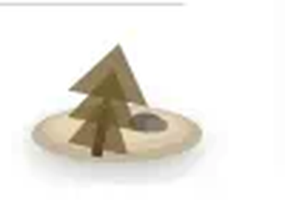

# Virtual Garden

A garden that sits on the page. Time on sites you mark productive grows it. The rest lets it wilt.

Four looks: zen, cosmic, ocean, pixel. Zen is the picture. Pick in Options.

See them live: https://roiyot26.github.io/virtual-garden/

## Load unpacked

    npm i
    npm run build

Chrome to Extensions, Developer mode, Load unpacked, `.output/chrome-mv3`.

## Tests

    npm test

Scoring: productive / (productive + non-productive). Neutral sites do not dilute it. Under five minutes of tracked time the garden stays at 50.

MIT